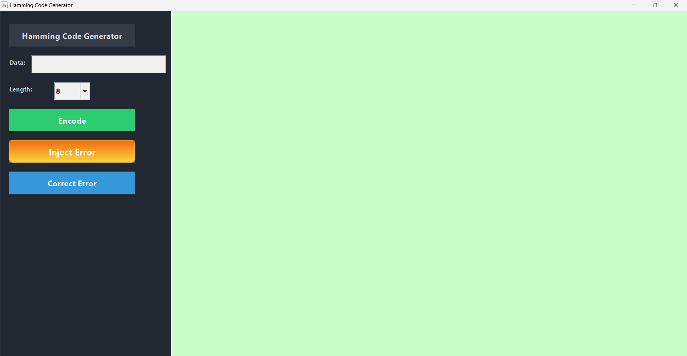
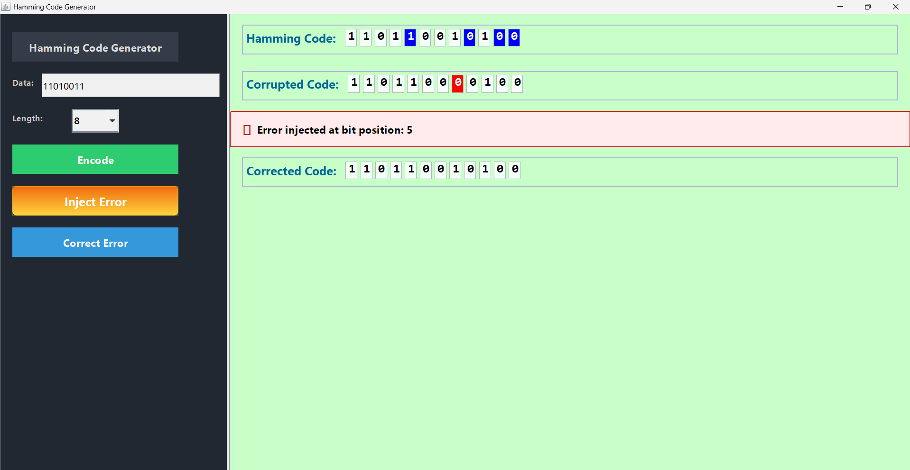
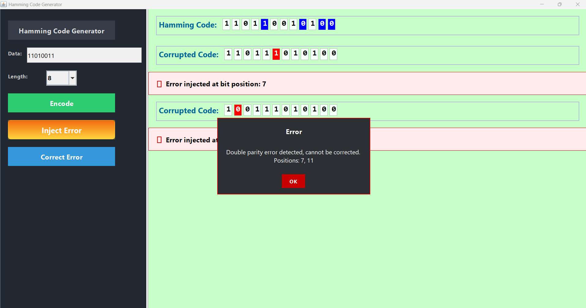

# 🛠️ Hamming Kodu Simülatörü (SEC-DED)

 Java Swing kullanılarak geliştirilen bu görsel uygulama, **SEC-DED (Single Error Correction - Double Error Detection)** yani tek bitlik hataları düzeltebilen, çift bitlik hataları tespit edebilen Hamming algoritmasını simüle eder.

---

## 🎯 Amaç
Bu projenin temel amacı, öğrencilerin hata düzeltme kodlarını daha iyi anlayabilmeleri ve Hamming Kodunun çalışma mantığını interaktif olarak görebilmeleridir. Renkli kutucuklar, görsel geri bildirimler ve uyarı pencereleri sayesinde teori pratikle buluşturulmuştur.

---

###  Başlamgıç Arayüzü

## 🔧 Özellikler

- [x] 8, 16 veya 32 bitlik veri girişi
- [x] Hamming kodu üretme (parity bitleriyle birlikte)
- [x] Maksimum 2 adet hatayı istenilen bit pozisyonlarında enjekte etme
- [x] Tekli hataları otomatik olarak düzeltme
- [x] Çiftli hataları tespit edip kullanıcıya bildirme (düzeltme yapılmaz)
- [x] Renk kodlaması ile hata ve parity bitlerinin görselleştirilmesi
- [x] Modern arayüz: Gradient butonlar, renklendirilmiş mesaj kutuları, kutu içinde bit gösterimi

---

## 🖼️ Arayüz ve Ekran Görüntüleri

### 1️⃣ Hamming kodu oluşturulduktan sonra tek bitlik hata enjekte edilmesi ve otomatik düzeltilmesi:

### 2️⃣ İki farklı pozisyonda hata enjekte edilmesi durumunda sistem uyarı verir:

### 3️⃣ Aynı bit konumuna iki kez hata uygulanırsa sistem veride hata olmadığını bildirir:

## ▶️ Kullanım

1. Uygulama açıldığında bir veri uzunluğu (8, 16, 32) seçin.
2. 0 ve 1'lerden oluşan verinizi yazın (örneğin: `11001100`).
3. **Encode** butonuna basarak Hamming kodunu oluşturun.
4. **Inject Error** butonuyla hata pozisyonu girin.
5. **Correct Error** butonuna tıklayarak sistemi test edin.

---

## 👨‍💻 Teknik Detaylar

- Parity bitleri kod dizisine 2ⁿ konumlara eklenir.
- Hamming kodu üretimi sırasında parity bitleri mavi renkle gösterilir.
- Hatalı bitler kırmızı, düzeltilmiş bitler eski haline döner.
- `detectError()` fonksiyonu sentetik hata tespitini gerçekleştirir.
- `encodeHamming()` fonksiyonu parity hesaplarını yapar.
- `drawBitRow()` fonksiyonu arayüzdeki kutuları çizmek için kullanılır.

---
✨ Geri bildirimleriniz ve yıldızlarınız projeyi daha da geliştirmemize katkı sağlar. Teşekkürler!

